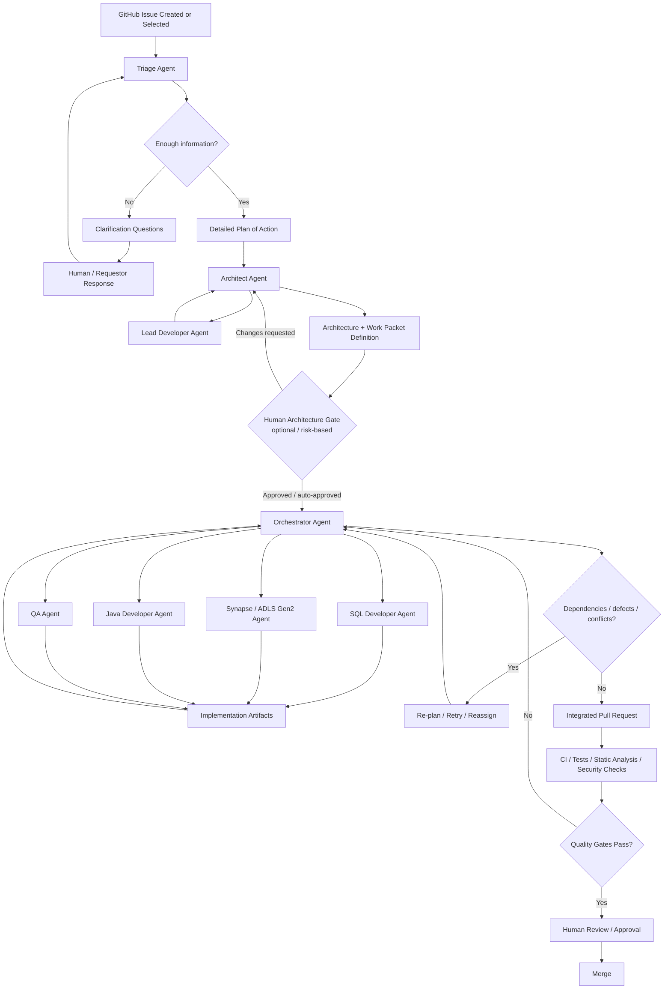
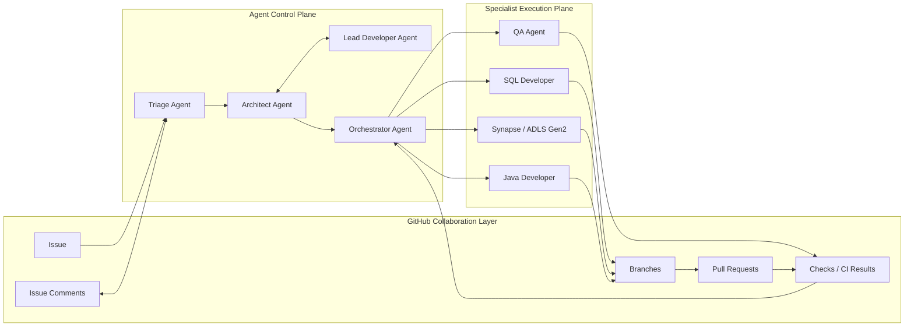
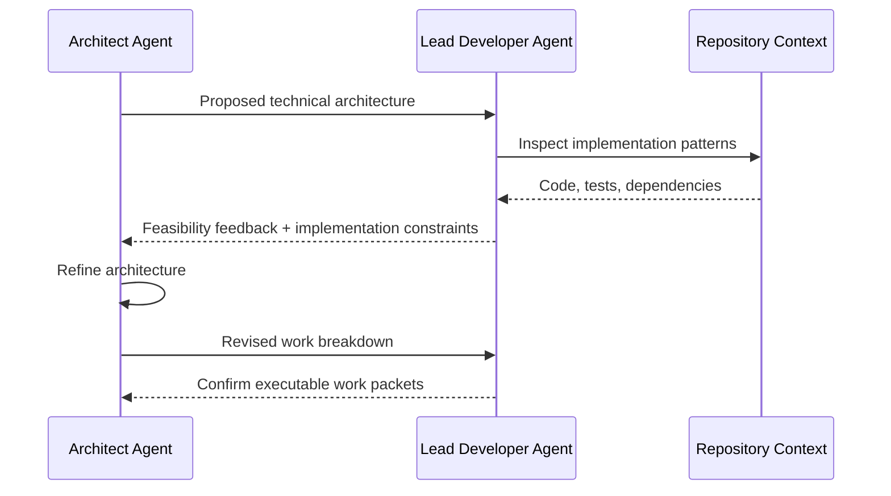
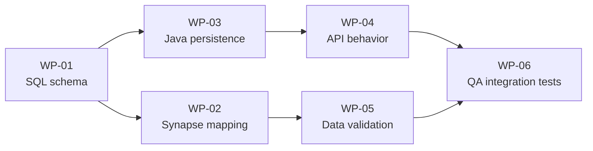
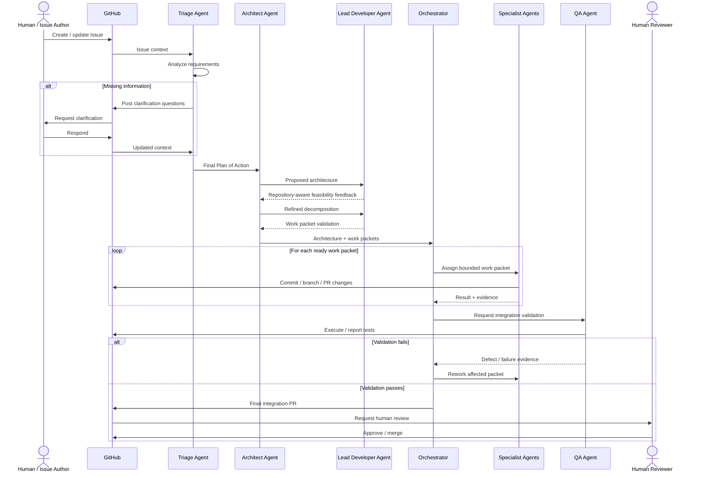
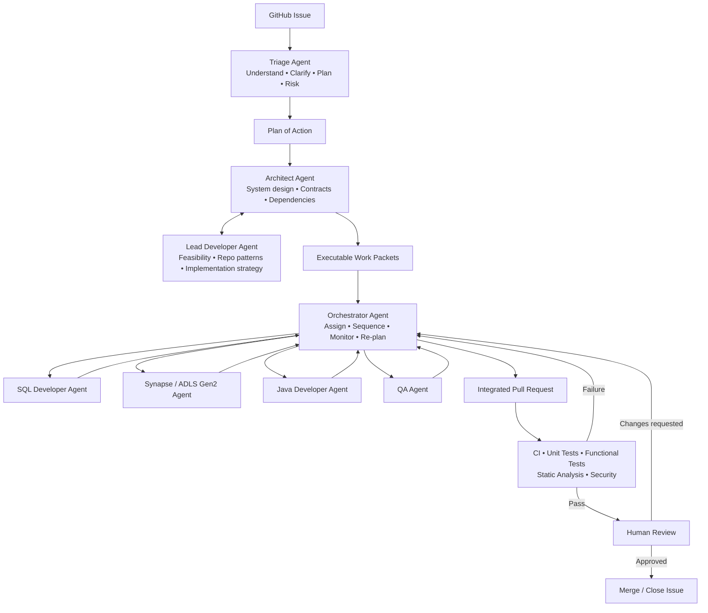

# GitHub Agentic Engineering Workflow
## From GitHub Issue Triage to Coordinated Multi-Agent Delivery

> **Context:** This design assumes a set of custom GitHub agents operating around normal GitHub engineering objects—Issues, issue comments, branches, pull requests, commits, reviews, and CI checks. The workflow is intentionally human-governed: agents automate analysis, decomposition, implementation, validation, and coordination, while humans retain approval authority at key gates.

---

## 1. Objective

The goal of the workflow is to turn a GitHub Issue into a traceable, reviewable set of implementation changes across a heterogeneous technology stack.

The workflow is divided into four major phases:

1. **Triage and clarification** — understand the issue and convert it into an actionable implementation plan.
2. **Architecture and decomposition** — determine the technical solution and break it into independently executable work packets.
3. **Orchestration and implementation** — assign work packets to specialist agents and coordinate dependencies.
4. **Integration and validation** — combine changes, run quality gates, resolve defects, and prepare the solution for human approval and merge.

The core design principle is that **each agent has a narrow responsibility and produces a structured artifact that becomes the input to the next stage**.

---

## 2. High-Level Workflow



---

## 3. Conceptual Architecture

The system can be viewed as three layers:



### Layer responsibilities

- **GitHub Collaboration Layer** is the system of record.
- **Agent Control Plane** performs reasoning, planning, decomposition, prioritization, dependency management, and coordination.
- **Specialist Execution Plane** performs bounded implementation work in the relevant technology domain.

---

# 4. End-to-End Flow

## Phase 1 — Triage and Clarification

### Triage Agent

The Triage Agent is the entry point for the workflow.

Its responsibility is **not to immediately implement the issue**. Its responsibility is to determine what the issue means, whether it is sufficiently specified, and what must happen to resolve it.

### Inputs

The agent should inspect:

- GitHub Issue title and description
- labels and metadata
- acceptance criteria
- linked Issues or Pull Requests
- relevant repository documentation
- existing implementation patterns
- test coverage related to the impacted area
- code ownership information
- deployment or operational constraints, when available

### Triage outputs

The Triage Agent produces a **Plan of Action** containing:

- problem statement
- current behavior
- expected behavior
- assumptions
- unknowns
- impacted components
- likely repositories/modules
- dependencies
- migration considerations
- backward-compatibility considerations
- data impact
- security implications
- testing expectations
- operational impact
- risk profile
- rough implementation complexity
- clarification questions
- proposed acceptance criteria

### Clarification loop

If important information is missing, the Triage Agent should post targeted questions to the GitHub Issue.

Example:

```text
Triage requires clarification:

1. Should the new field be populated for historical records?
2. Is backward compatibility required for version 2.x clients?
3. Is the Synapse schema expected to change in the same release?
4. What is the expected behavior when the source value is null?
```

The Triage Agent re-evaluates the issue after each response.

The loop continues until either:

- the issue is sufficiently specified, or
- a human explicitly accepts documented assumptions.

### Triage completion artifact

A structured section can be posted to the Issue:

```yaml
triage_status: complete
problem_summary: "..."
risk:
  level: medium
  reasons:
    - schema change
    - downstream data dependency
affected_domains:
  - java
  - sql
  - synapse
clarifications_resolved: true
architecture_required: true
```

This becomes the input to the Architect Agent.

---

# 5. Architecture and Technical Decomposition

## Architect Agent

The Architect Agent converts the business/engineering plan into a **coherent technical solution**.

The Architect Agent should reason across the whole change rather than one technology silo.

Typical responsibilities include:

- identifying architectural impact
- defining component boundaries
- deciding which systems must change
- defining contracts between work packets
- identifying sequencing constraints
- defining migration strategy
- identifying rollback considerations
- identifying cross-cutting concerns
- defining observability expectations
- determining whether implementation can occur in parallel

### Architect Agent output

The output should contain:

```yaml
architecture:
  summary: "..."
  components:
    - java-service
    - sql-database
    - synapse-pipeline
  contracts:
    - "Java DTO field customerType maps to SQL column customer_type"
  sequencing:
    - "SQL schema must be available before integration tests execute"
  risks:
    - "Existing downstream reports may assume old schema"
  rollback:
    - "Application remains compatible with nullable column"
```

---

## Lead Developer Agent

The Lead Developer Agent is a technical implementation counterpart to the Architect Agent.

Where the Architect asks:

> What is the correct system design?

The Lead Developer asks:

> How should this design be implemented safely in this repository?

The interaction between the Architect and Lead Developer should be iterative.

### Lead Developer responsibilities

- validate feasibility against the existing codebase
- identify repository conventions
- propose implementation patterns
- estimate engineering complexity
- identify hidden coupling
- identify existing reusable components
- challenge unnecessary architectural complexity
- identify test strategy
- identify likely merge conflicts
- recommend implementation order

### Architecture ↔ Lead Developer loop



The loop ends when the design is both:

- architecturally coherent, and
- executable by the specialist agents.

---

# 6. Work Packets

A **work packet** is the primary unit of execution for the Orchestrator.

A work packet should be small enough that one specialist agent can own it without needing to rediscover the entire issue.

Each work packet should contain:

```yaml
work_packet:
  id: WP-03
  title: "Add customer_type support to Java persistence layer"
  owner_type: java-agent

  objective: >
    Add customerType to the persistence model and API mapping.

  dependencies:
    - WP-01

  files_or_modules:
    - service/src/main/java/...
    - service/src/test/java/...

  inputs:
    - architecture contract v1
    - SQL schema definition from WP-01

  expected_changes:
    - domain model
    - persistence mapping
    - API DTO
    - unit tests

  acceptance_criteria:
    - existing API behavior remains backward compatible
    - null customer_type values are supported
    - unit tests pass

  validation:
    - mvn test
    - static analysis

  risk: medium
```

---

# 7. Orchestrator Agent

The Orchestrator Agent manages **execution**, not architecture.

Its job is to take the approved work packets and ensure they are completed in the correct order.

The Orchestrator maintains a dependency graph such as:



### Orchestrator responsibilities

The Orchestrator should:

- assign work packets to specialist agents
- track work packet status
- respect dependencies
- enable parallel execution where safe
- provide each agent with bounded context
- detect blocked tasks
- request clarification from Architect/Lead Developer when required
- detect implementation conflicts
- trigger rework
- aggregate implementation results
- maintain traceability to the original Issue
- decide when the complete change is ready for integration validation

### Suggested states

```text
PLANNED
READY
IN_PROGRESS
BLOCKED
READY_FOR_VALIDATION
FAILED_VALIDATION
DONE
```

### Example orchestration state

```yaml
execution:
  WP-01:
    agent: sql-agent
    status: DONE

  WP-02:
    agent: synapse-agent
    status: IN_PROGRESS
    depends_on:
      - WP-01

  WP-03:
    agent: java-agent
    status: READY
    depends_on:
      - WP-01

  WP-06:
    agent: qa-agent
    status: BLOCKED
    depends_on:
      - WP-02
      - WP-04
      - WP-05
```

---

# 8. Specialist Agents

## 8.1 SQL Developer Agent

Primary scope:

- DDL changes
- stored procedures
- views
- SQL migration scripts
- data migration
- query behavior
- database-focused tests
- rollback scripts where applicable

Expected output:

- changed SQL artifacts
- migration notes
- validation queries
- performance considerations
- compatibility notes

The SQL Agent should not independently change application-level contracts unless the work packet explicitly permits it.

---

## 8.2 Synapse / ADLS Gen2 Agent

Primary scope:

- Synapse pipelines
- notebooks
- data ingestion
- transformations
- ADLS Gen2 paths/layouts
- schema mappings
- partitioning
- data quality checks
- integration with upstream/downstream datasets

Expected output:

- pipeline/notebook changes
- mapping changes
- data contract validation
- test or sample execution evidence
- downstream impact notes

---

## 8.3 Java Developer Agent

Primary scope:

- Java service code
- domain models
- repositories
- API layers
- mapping logic
- business logic
- configuration
- Java unit/integration tests

Expected output:

- implementation changes
- tests
- build results
- compatibility observations
- any assumptions discovered during coding

---

## 8.4 QA Agent

The QA Agent should operate at two levels.

### Early involvement

Before implementation completes, QA reviews:

- acceptance criteria
- edge cases
- failure conditions
- regression risk
- required test data

### Final validation

After implementation:

- integration tests
- functional tests
- regression tests
- negative-path tests
- cross-component validation
- acceptance-criteria verification

The QA Agent should report evidence rather than simply state "tests passed."

Example:

```yaml
qa_result:
  status: PASS
  tests:
    - name: "customer type populated"
      status: PASS
    - name: "legacy null record"
      status: PASS
    - name: "synapse downstream mapping"
      status: PASS
  regressions_detected: false
```

---

# 9. GitHub-Native Execution Model

A useful implementation pattern is to make GitHub itself the workflow ledger.

## Issue

The original Issue holds:

- business context
- clarification conversation
- final triage plan
- architecture summary
- links to generated work packets
- final delivery status

## Branches

Specialist agents can work on isolated branches, for example:

```text
agent/WP-01-sql-schema
agent/WP-02-synapse-mapping
agent/WP-03-java-persistence
agent/WP-06-qa-validation
```

## Pull Requests

A specialist-agent Pull Request should include:

```markdown
## Work Packet
WP-03

## Parent Issue
#1234

## Objective
Add customer_type support to Java persistence.

## Dependencies
- WP-01 complete

## Changes
- Added field to entity
- Updated persistence mapping
- Added unit tests

## Validation
- mvn test: PASS
- static analysis: PASS

## Open Questions
None
```

Depending on repository strategy, the Orchestrator may either:

1. coordinate several dependent PRs, or
2. combine completed work onto an integration branch and create one final PR.

---

# 10. Full Agent Interaction Sequence



---

# 11. Human-in-the-Loop Gates

The workflow should not require human approval after every agent action. Instead, gates can be risk-based.

Recommended human checkpoints:

| Gate | When required | Human decision |
|---|---|---|
| Clarification | Requirements are ambiguous | Answer questions or approve assumptions |
| Architecture | High-impact or cross-system change | Approve architecture |
| Data migration | Destructive or irreversible data change | Approve migration strategy |
| Security | Auth, secrets, PII, permissions, external exposure | Approve security-impacting design |
| Final PR | Normal production delivery | Review and approve merge |

Low-risk changes may allow some intermediate gates to be automated.

---

# 12. Risk Profile

The Triage and Architect Agents should attach a risk profile to the Issue.

Example:

```yaml
risk_profile:
  overall: high

  dimensions:
    data_loss:
      level: medium
      reason: "Schema migration required"

    backward_compatibility:
      level: medium
      reason: "Existing consumers may omit new field"

    security:
      level: low

    operational:
      level: medium
      reason: "Synapse pipeline deployment required"

    blast_radius:
      level: high
      reason: "Shared downstream dataset"
```

Risk can influence:

- whether human architecture approval is mandatory
- number of reviewers
- test depth
- whether canary deployment is required
- whether automatic merge is allowed
- whether rollback rehearsal is required

---

# 13. Cost and Effort Estimation

The whiteboard concept can also be captured as an optional output of Triage/Architecture.

The goal should not be false precision. Instead, agents can estimate relative effort.

Example:

```yaml
estimate:
  complexity: large
  work_packets: 6

  expected_agent_effort:
    sql: medium
    synapse: medium
    java: high
    qa: high

  uncertainty: medium

  uncertainty_drivers:
    - downstream Synapse consumers not fully mapped
    - production data distribution unknown
```

This helps the team understand whether the Issue is ready for autonomous execution or should be split.

---

# 14. Context Management

A common failure mode in multi-agent systems is giving every agent the entire repository and entire conversation.

Instead, use **progressive context narrowing**.

```text
GitHub Issue
    ↓
Triage context
    ↓
Architecture context
    ↓
Work packet
    ↓
Specialist context
```

Each specialist should receive only:

- original Issue summary
- relevant architecture decisions
- its work packet
- required upstream contracts
- relevant repository files
- expected output
- acceptance criteria

This reduces:

- conflicting interpretations
- unnecessary token/context usage
- accidental cross-domain edits
- duplicated reasoning

---

# 15. Agent Contract

Every agent should return a common envelope so the Orchestrator can treat agents consistently.

```yaml
agent_result:
  agent: java-agent
  work_packet: WP-03
  status: completed

  summary: >
    Added customerType to persistence and API mapping.

  changes:
    - path: service/src/main/java/.../Customer.java
      action: modified

  validation:
    - command: mvn test
      result: pass

  assumptions:
    - "customer_type is nullable"

  discovered_risks: []

  blockers: []

  follow_up_work: []
```

This contract is important because the Orchestrator should consume machine-readable results rather than infer status from free-form prose.

---

# 16. Failure Handling

The system should explicitly model failure.

## Implementation failure

If a specialist cannot complete a packet:

```text
Specialist Agent
      ↓
BLOCKED result
      ↓
Orchestrator
      ↓
Determine cause
  ┌───────────────┬────────────────────┐
  ↓               ↓                    ↓
Missing       Architecture          Technical
context       ambiguity             failure
  ↓               ↓                    ↓
Triage /      Architect /           Retry or
Human         Lead Developer        reassign
```

## Validation failure

A QA or CI failure should generate a new corrective action tied to the original work packet.

The Orchestrator should avoid telling every agent to "try again."

Instead:

1. identify the failing contract,
2. identify the owning packet,
3. provide failure evidence,
4. reopen only the necessary work,
5. re-run dependent validation.

---

# 17. Guardrails

Recommended agent guardrails include:

- agents may modify only files relevant to their work packet
- agents should not silently expand scope
- changes to shared contracts require Architect approval
- failed tests must not be bypassed without explicit justification
- agents should never declare success without evidence
- generated migrations should include rollback strategy when practical
- secrets must not be added to repository content
- agent-generated code follows existing repository conventions
- every change must retain traceability to the parent Issue and work packet

---

# 18. Definition of Done

The overall GitHub Issue is complete only when:

- clarification is resolved
- the plan of action is recorded
- architecture is finalized
- all work packets are complete
- all required code/data changes are integrated
- unit tests pass
- integration/functional tests pass
- static analysis and security checks pass where configured
- QA verifies acceptance criteria
- unresolved assumptions are documented
- final PR has human approval when required
- the PR is merged
- the original Issue is updated with final implementation evidence

---

# 19. Example Work Breakdown

For an Issue that requires a new business field to flow from a Java API into SQL and then into Synapse, decomposition might be:

| Work Packet | Owner | Description | Dependency |
|---|---|---|---|
| WP-01 | SQL Agent | Add database column and migration | None |
| WP-02 | Synapse Agent | Update ingestion/mapping | WP-01 |
| WP-03 | Java Agent | Update persistence model | WP-01 |
| WP-04 | Java Agent | Update API/business logic | WP-03 |
| WP-05 | Synapse Agent | Update downstream transformation | WP-02 |
| WP-06 | QA Agent | Cross-system integration tests | WP-04, WP-05 |

This permits WP-02 and WP-03 to execute in parallel once WP-01 is complete.

---

# 20. Recommended Issue Status Block

The Orchestrator can maintain a compact status section in the original GitHub Issue.

```markdown
## Agentic Delivery Status

**Triage:** ✅ Complete  
**Architecture:** ✅ Complete  
**Risk:** Medium  
**Execution:** In progress

| Packet | Agent | Status |
|---|---|---|
| WP-01 | SQL | ✅ Done |
| WP-02 | Synapse | 🔄 In progress |
| WP-03 | Java | ✅ Done |
| WP-04 | Java | ⏳ Ready |
| WP-05 | Synapse | ⛔ Blocked by WP-02 |
| WP-06 | QA | ⛔ Waiting for implementation |

### Latest orchestration note
Synapse mapping is currently on the critical path.
```

This lets the GitHub Issue remain the single high-level place where humans can understand system state.

---

# 21. Design Principles

The workflow should follow several principles.

### 1. Plan before code

No specialist agent starts implementation until the issue has been converted into an explicit plan.

### 2. Architecture is separate from orchestration

The Architect determines **what the solution should look like**.

The Orchestrator determines **how the work gets executed**.

### 3. Specialist agents stay specialized

SQL, Java, Synapse, and QA agents should own bounded domains rather than independently redesign the overall system.

### 4. GitHub remains the audit trail

Important agent decisions, assumptions, implementation artifacts, and validation results should be reflected in GitHub objects.

### 5. Humans govern risk

Human involvement should increase as risk, ambiguity, irreversibility, or blast radius increases.

### 6. Evidence over confidence

An agent should report:

> "12 integration tests passed and the schema contract check succeeded."

rather than:

> "This looks correct."

### 7. Re-plan rather than blindly retry

A failed work packet is information. The Orchestrator should use it to refine context, dependencies, or architecture instead of repeatedly invoking the same agent with the same prompt.

---

# 22. Final Reference Architecture



---

## Summary

The proposed GitHub agentic workflow is a **hierarchical multi-agent engineering system**:

```text
Issue
  ↓
Triage Agent
  ↓
Detailed Plan of Action
  ↓
Architect Agent ↔ Lead Developer Agent
  ↓
Executable Work Packets
  ↓
Orchestrator Agent
  ↓
SQL | Synapse/ADLS | Java | QA
  ↓
Integrated Validation
  ↓
Human Review
  ↓
Merge
```

The most important architectural choice is the separation between **reasoning about the problem**, **designing the solution**, **orchestrating execution**, and **performing specialist implementation**.

That separation makes the workflow easier to govern, debug, scale, and audit while preserving GitHub as the central engineering collaboration and traceability layer.
