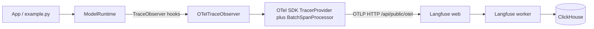

# Phased OpenTelemetry + Langfuse Observability

## Context

- `model-runtime` is an async LLM invocation library. The instrumentation seam already exists: the `TraceObserver` protocol in [src/model_runtime/tracing.py](src/model_runtime/tracing.py) (`on_request` / `on_response` / `on_error`), injected into `ModelRuntime`, with observer failures swallowed so telemetry can never break model calls.
- Langfuse v3 is OTel-native: it ingests standard OTLP/HTTP traces at `http://localhost:3000/api/public/otel` (Basic auth from project public:secret keys, header `x-langfuse-ingestion-version: 4`) and understands GenAI semantic conventions (`gen_ai.*`) plus its own `langfuse.*` attribute namespace.
- Per your choices: instrumentation ships inside the package as a `model-runtime[otel]` extra; we start with the raw OTel SDK and add the Langfuse SDK later.

## Phase 0 — Self-hosted Langfuse (learn: what an observability backend is)

- Add `observability/docker-compose.yml` (from the official Langfuse self-hosting compose): `langfuse-web`, `langfuse-worker`, `postgres`, `clickhouse`, `redis`, `minio` (+ bucket init).
- Bring it up, create an org/project in the UI at `localhost:3000`, generate `pk-lf-*/sk-lf-*` keys, store in `.env` (git-ignored).
- Smoke-test ingestion with a minimal standalone script sending one hand-made OTLP span.
- Deliverable: running backend + short notes in `observability/README.md` on what each container does.

## Phase 1 — Raw OTel instrumentation via TraceObserver (learn: tracer, span, processor, exporter)

- New optional extra in [pyproject.toml](pyproject.toml): `otel = ["opentelemetry-sdk", "opentelemetry-exporter-otlp-proto-http"]` (API+SDK pinned with compatible ranges).
- New module `src/model_runtime/observability/` containing an `OTelTraceObserver` implementing `TraceObserver`:
  - `on_request` starts a span; `on_response`/`on_error` end it with status, latency, and GenAI semconv attributes (`gen_ai.operation.name`, `gen_ai.request.model`, `gen_ai.usage.input_tokens`, `gen_ai.usage.output_tokens`, provider name).
  - Design note: the protocol has no per-call correlation handle. Since each call runs in one task, correlate `on_request`/`on_response` with a `contextvars.ContextVar` holding the open span; if that proves fragile we make the smallest coherent refactor (observer returns a per-call handle) as a follow-up.
  - The observer takes an injected `Tracer` (no global state inside the library; import of OTel guarded so the base package works without the extra).
- Wiring stays app-side: extend [example.py](example.py) to build `TracerProvider` + `BatchSpanProcessor` + OTLP exporter pointed at Langfuse, with auth from env.
- Tests with `InMemorySpanExporter` (network-free, fits existing test style).
- Deliverable: run `example.py`, see one generation-like trace per model call in Langfuse UI with model + token usage.

## Phase 2 — Richer, structured traces (learn: context propagation, nesting, span events, sampling)

- Parent spans: wrap a `ChatSession` turn (or app-level operation) in an enclosing span so generations nest under it; observe OTel context propagation across async code.
- Opt-in content capture: record prompt/response text as attributes only when explicitly enabled (privacy default off), mirroring `OTEL_INSTRUMENTATION_GENAI_CAPTURE_MESSAGE_CONTENT`.
- Add span events for retries (decide: one span for the whole retry loop with events per attempt — matches current observer semantics), error taxonomy from `errors.py`, resource attributes (`service.name`, version), and experiment with samplers.
- Deliverable: multi-span traces in Langfuse showing session → generation hierarchy.

## Phase 3 — Langfuse-native features (learn: Langfuse data model on top of OTel)

- Use `langfuse.*` span attributes (still raw OTel — no new SDK yet) to map cleanly to Langfuse's model: `langfuse.session.id`, `langfuse.user.id`, observation types, tags, metadata.
- Then introduce the Langfuse Python SDK v3 at the app layer (it is itself an OTel `SpanProcessor`), comparing it side-by-side with the raw approach: `start_as_current_observation(as_type="generation")`, `propagate_attributes`, cost tracking.
- Deliverable: traces with sessions, users, and costs; a short written comparison of raw-OTel vs Langfuse-SDK trade-offs in `observability/README.md`.

## Phase 4 — Evaluation (learn: datasets, scores, LLM-as-judge)

- Create a small Langfuse dataset from captured traces; attach scores via the Langfuse API/SDK (manual scores first, then an LLM-as-judge evaluator configured in the Langfuse UI).
- Optionally a small eval script under `observability/` that runs the dataset through `ModelRuntime` and records dataset-run results.
- Deliverable: dataset runs with scores visible in Langfuse.

## Phase 5 — Production hardening (learn: collector, reliability, operations)

- Insert an OpenTelemetry Collector between app and Langfuse (`otlphttp` exporter, batching, retry/queueing, fan-out potential to other backends); app now exports to the collector only.
- Operational concerns: graceful shutdown/flush on exit, exporter timeout/failure behavior, sampling strategy for volume, env-driven configuration (`OTEL_EXPORTER_OTLP_*`), secrets handling.
- CI: keep all package tests network-free; observability integration checks stay local/manual or behind a marker.
- Deliverable: documented, production-shaped topology in `observability/`.

## Cross-cutting

- README impact per repo rules: each phase updates `README.md` (new extra, `observability/` directory, usage, limitations) and keeps `AGENTS.md`-relevant docs in sync.
- Each phase is independently shippable; we implement one phase per session so you can absorb the concepts before the next.
